# NASA HoloLens Guide

For questions, comments, or concerns, contact Yasmeen Roumie at [nasahololens@gmail.com](mailto:nasahololens@gmail.com) 
***

### [Install Development Tools](https://www.google.com/url?q=https://developer.microsoft.com/en-us/windows/holographic/install_the_tools&sa=D&ust=1477960328060000&usg=AFQjCNGoczCPdBlamiAfHfYYKpMpE7sBHA)

You must first install ALL of these programs in order to begin developing for the HoloLens.

1)  [Visual Studio 2015 Update 3](https://www.google.com/url?q=http://dev.windows.com/downloads&sa=D&ust=1477960328062000&usg=AFQjCNF6Z61T9iL13YKBmDLfI53eGWSrFw) (Developer Tools and Services for writing code and deploying applications from Unity onto HoloLens)
 
2)  [HoloLens Emulator](http://go.microsoft.com/fwlink/?LinkID=799831) (An add-on to Visual Studios to run applications on a simulated computer program that acts like a HoloLens interface)
 
3)  [Unity HoloLens Technical Preview](https://www.google.com/url?q=http://aka.ms/HoloLensUnity&sa=D&ust=1477960328063000&usg=AFQjCNEbYTEjvsp_DqxbkxxIVcWf_8o2jw) (Game/Application Development platform specifically designed for HoloLens to create Mixed Reality applications)

### [Follow Tutorials from Windows Holographic Academy](https://www.google.com/url?q=https://developer.microsoft.com/en-us/windows/holographic/academy&sa=D&ust=1477960328064000&usg=AFQjCNFfYB6yz3B9itGh6mbpJ6ZpJ6Marw)

Microsoft created these tutorials, and many of them include videos. They are quite project specific though, so you would need to change a lot of things to fit your own project’s needs.

1)  [Holograms 100: Getting Started with Unity](https://www.google.com/url?q=https://developer.microsoft.com/en-us/windows/holographic/holograms_100&sa=D&ust=1477960328065000&usg=AFQjCNH4Bole-MG8zEi1FQmCgoNn_GGC9A)
 
2)  [Holograms 101E: Introduction with Emulator](https://www.google.com/url?q=https://developer.microsoft.com/en-us/windows/holographic/holograms_101e&sa=D&ust=1477960328065000&usg=AFQjCNFcyy37Tg-dK5b2JrIax8rFI6bb5A) - how to run an application on the HoloLens emulator
 
3)  [Holograms 101: Introduction with Device](https://www.google.com/url?q=https://developer.microsoft.com/en-us/windows/holographic/holograms_101&sa=D&ust=1477960328066000&usg=AFQjCNGdktwYEfRtYhvIRDYLUgpc851AJw) - how to run an application on the actual HoloLens device
 
4)  [Holograms 210: Gaze](https://www.google.com/url?q=https://developer.microsoft.com/en-us/windows/holographic/holograms_210&sa=D&ust=1477960328067000&usg=AFQjCNFtzQDH8tmwinnoskmC0bs6UAYDMA)
 
5).  [Holograms 211: Gesture](https://www.google.com/url?q=https://developer.microsoft.com/en-us/windows/holographic/holograms_211&sa=D&ust=1477960328067000&usg=AFQjCNEXl8IxGpcvRYKtg3BP0jksNyrNCw)
 
6)  [Holograms 212: Voice](https://www.google.com/url?q=https://developer.microsoft.com/en-us/windows/holographic/holograms_212&sa=D&ust=1477960328068000&usg=AFQjCNE_eWRrPXMWyTiHbohFN3t1b9JwwA)
 
7)  [Holograms 220: Spatial sound](https://www.google.com/url?q=https://developer.microsoft.com/en-us/windows/holographic/holograms_220&sa=D&ust=1477960328069000&usg=AFQjCNGM-KawIOJL-xGWWqGl51oZqP0sQA)
 
8)  [Holograms 230: Spatial mapping](https://www.google.com/url?q=https://developer.microsoft.com/en-us/windows/holographic/holograms_230&sa=D&ust=1477960328070000&usg=AFQjCNHAzU4_mdjENkSQxfTRVPkUBP5fOQ)
 
9)  [Holograms 240: Sharing holograms](https://www.google.com/url?q=https://developer.microsoft.com/en-us/windows/holographic/holograms_240&sa=D&ust=1477960328071000&usg=AFQjCNFavzyLg4p83hx--XiJ-6CV3un5fQ) (only if you have more than one HoloLens)
 

### Custom Tutorials
####  Start a Simple HoloLens Project from Scratch

*   On the Unity start up window, select New.

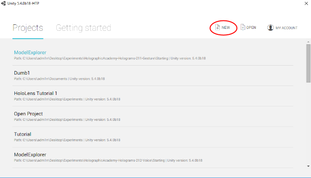

*   Name your project (1), choose where you want to store your project (2), select 3D (3), turn Unity Analytics off (4, optional), and select Create project (5).

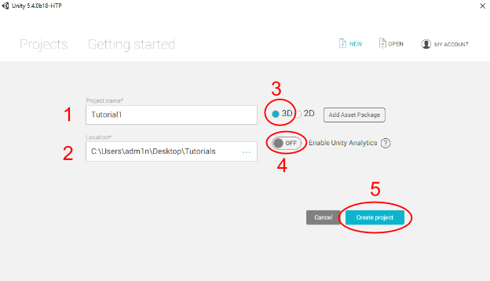

*   To download HoloTookit from Github, go here: [https://github.com/Microsoft/HoloToolkit-Unity](https://www.google.com/url?q=https://github.com/Microsoft/HoloToolkit-Unity&sa=D&ust=1477960328077000&usg=AFQjCNFSNxLTU44r3cBC1Me6Rs4Y_Y-KZQ). Hover over Clone or download and click on Download ZIP.

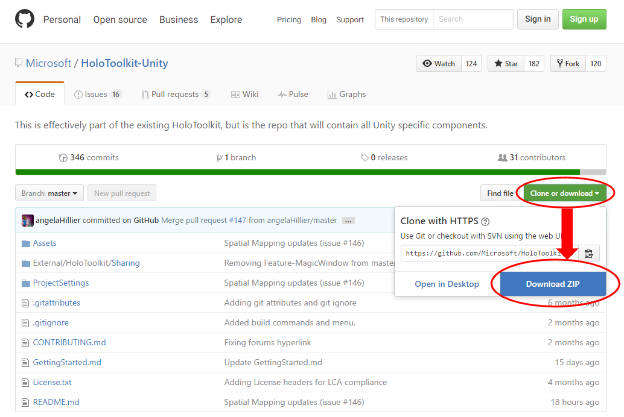

*   Go to Downloads → HoloToolkit-Unity-master (Zip File) and click Extract all.

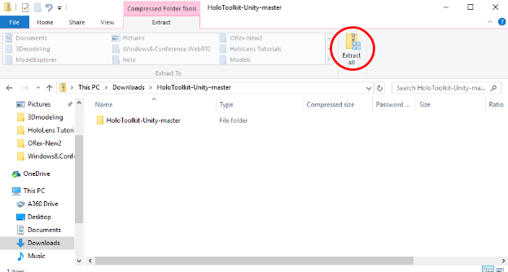

*   Go to Downloads → HoloToolkit-Unity-master (Unzipped File) → HoloToolkit-Unity-Master → Assets.

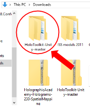

*   Drag everything from the HoloToolkit Assets folder under Assets in the Project panel.

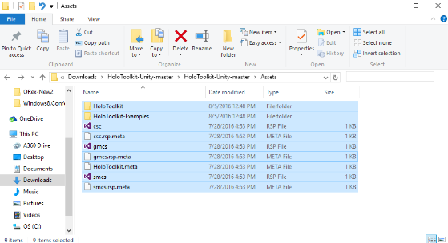

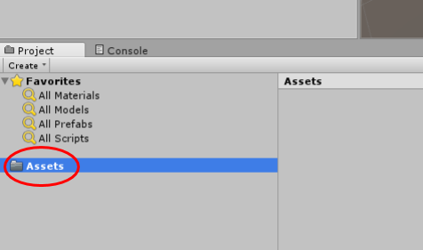

*   Import a 3D model by clicking on Assets → Import New Asset...

 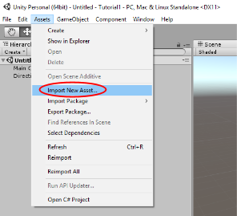

*   Find the right model you want to import (Unity 5.4 only supports .Fbx, .dae, .3DS, .dxf, and .obj 3D files)

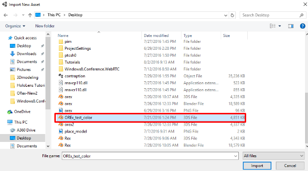

*   Go to the Assets folder in the Project panel and locate your newly imported 3D model. Drag it into your Scene.

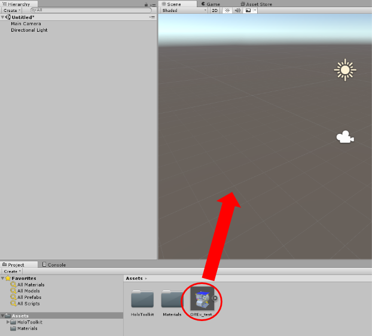

*   Adjust the Scale of your model in the Inspector panel to make it actually fit in the Scene panel if it’s too big or make it large enough to be visible if it’s too small. Make the Position the origin (0, 0, 0) because you will later place it inside another object.

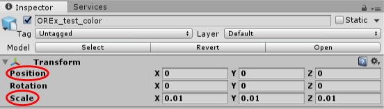

*   Go to File → Save Scene As… , create a new folder called Scenes inside the Assets folder of your Unity project, and save your new scene.

*   In the Hierarchy panel, select the Main Camera.

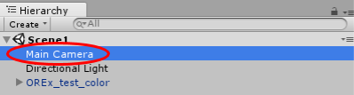

*   In the Inspector panel, change the Position to (0, 0, 0). In the Clear Flags dropdown, choose Solid Color. For Background, make the color black → RGBA (0, 0, 0, 0). Change the Clipping Planes value for Near from 0.3 to 0.85 to prevent the holograms from appearing too close to the user's’ eyes.

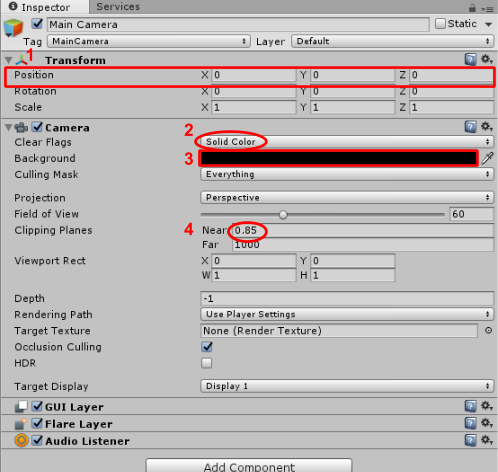

*   Back in the Hierarchy panel, hover over Create and click Create Empty.

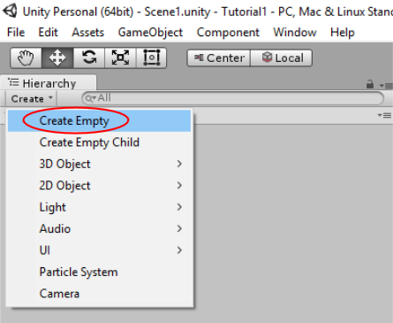

*   Drag your 3D model directly under GameObject so that it is nested.

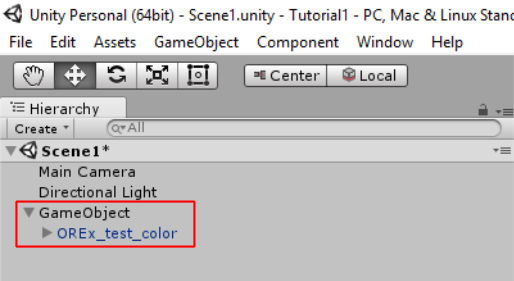

*   Select GameObject in the Hierarchy panel. In the Inspector panel, increase the Z Position until your model is placed how you want it in front of the camera. To see a preview of what it will look like you can either select Main Camera in the Hierarchy and view the Camera Preview in the Scene tab or just go to the Game tab.

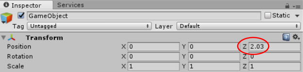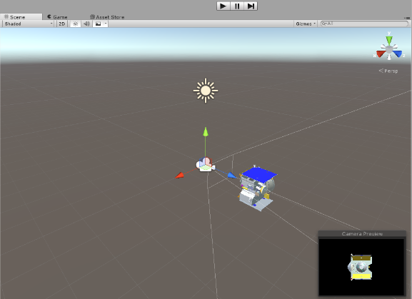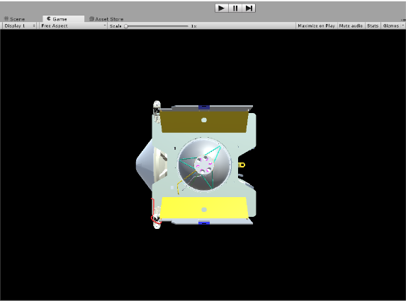

*   Go to Edit → Project Settings → Quality. In the Inspector panel, click on the down arrow next to Default and under the green Windows logo and select Fastest.

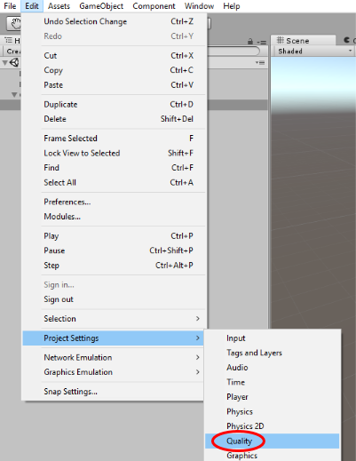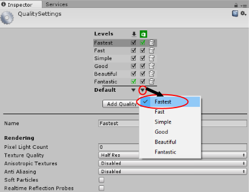

*   Go to File → Build Settings. Click Add Open Scenes (1) and under Platform on the left, select Windows Store. For SDK, choose Universal 10 (2) and for UWP Build Type choose D3D (3). Under Debugging, check off Unity C# Projects (4). Click Player Settings (5).

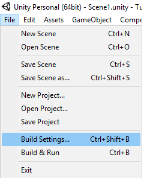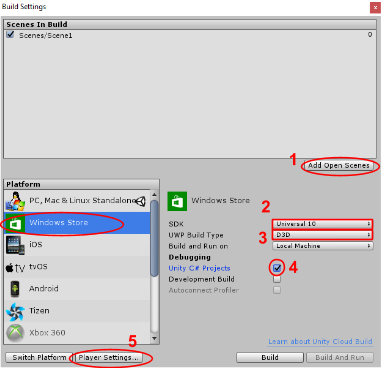

*   In the Inspector panel, make sure you’re in Settings for Windows Store tab. Expand Other Settings and check off Virtual Reality Supported. Add Windows Holographic under Virtual Reality SDKs if it’s not already there by clicking the “+” and selecting it.

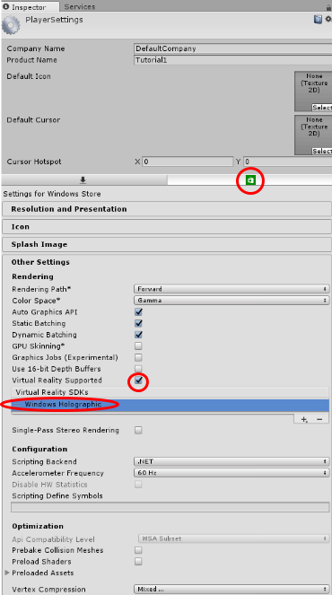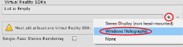

*   Go back to the Build Settings window and click Build.
*   Click on New Folder (1) and rename your folder (2) to something that will help you keep track of build versions--for example, Build01, Build02...Build99\. Click Select Folder (3).

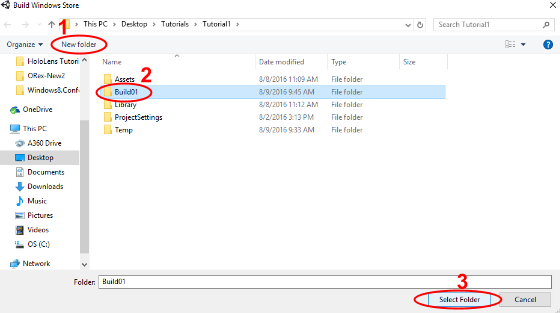

*   Once the build is done, a file explorer window will pop up. Go to your build folder (e.g. Build01), then to the project folder inside that (e.g. Tutorial1), and double click on the AppX Manifest Source File named Package to open it in Visual Studio.

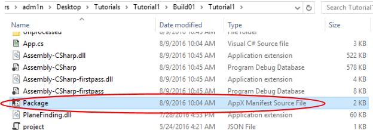

*   On line 11 where it says TargetDeviceFamily, change Name=“Windows.Universal” to Name=“Windows.Holographic” and save the file (Ctrl + S)

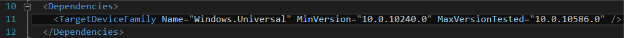

*   Return to your build folder (e.g. Build01). Double click on the new Microsoft Visual Studio Solution file which is named after your project (e.g. Tutorial1).

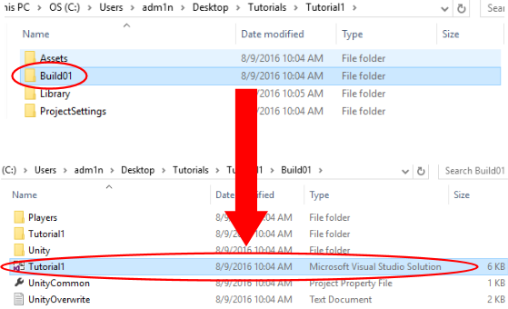

*   Visual Studio should open up again. Under the menu bar, there are three dropdown menus. In order, select Release, x86, and HoloLens Emulator OR Device. Click where you just selected HoloLens Emulator to run it on the emulator. If you chose Device, you need to make sure your HoloLens is plugged into your computer via USB and the device itself must be turned on.

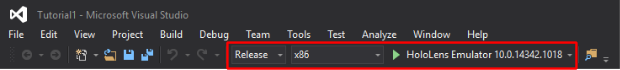

*   It may take a bit of time to load up, but when your app is successfully deployed, an orange bar will appear at the bottom of the Visual Studios window.
*   In the Project panel, go to Assets → HoloToolkit → Input → Prefabs and drag Cursor into the Hierarchy panel.

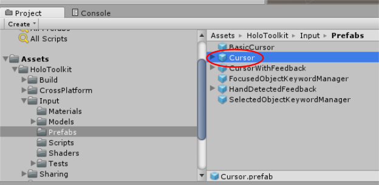

*   In the Hierarchy, select your GameObject. In the Inspector panel, click Add Component, type in Gaze Manager, and select the first option. Do the same thing, but type in Gesture Manager this time.

####  Opening Projects

*   Hover over File and select Open Scene

*   Find the file you are looking for and click to open it
*   (Hint: if you are trying to open Holograms 210, click on Holograms 210, Starting, and then Model Explorer to open the file)
*   (Hint: if you are trying to open Holograms 211, click on Holograms 211, click on Holograms 211, Starting, Model Explorer, Assets, Scenes, and then Model Explorer to open the file)
*   (Hint: Always look for the unity extension when opening a file)

####  Importing 3D Models

*   Hover over Assets in the upper left hand corner
*   Click import new asset
*   Find the right model you want to import (Unity 5.4 only supports .Fbx, .dae, .3DS, .dxf, and .obj 3D files)

####  Rotation in Multiple Axes (X, Y, & Z)

*   Open up the GestureManager script by double clicking on it
*   For Y-Axis: In line 35 of the code you want to add GestureSettings.NavigationY
*   For Z-Axis: In line 35 of the code you want to add GestureSettings.NavigationZ
*   Save that by pressing Ctrl S
*   Open up the GestureAction script by double clicking on it
*   In lines 15-17, Add the following:
*   private float rotationFactorX (Line 15); 
*   private float rotationFactorY; (Line 16)
*   private float rotationFactorZ (Line 17);
*   Comment out: rotationFactor = GestureManager.Instance.NavigationPosition.x * RotationSensitivity; (Line 35)
*   Add these to Lines 36-37:
*   rotationFactorX = GestureManager.Instance.NavigationPosition.x * RotationSensitivity; (Line 36)
*   rotationFactorY = GestureManager.Instance.NavigationPosition.y * RotationSensitivity; (Line 37)
*   Comment out what Line 42 has for code and replace it with:
*   transform.Rotate(new Vector3(rotationFactorX, -1 * rotationFactorY, 0), Space.World);
*   Hint: Most of the time with the HoloLens, the correct transform.Rotate code would be transform.Rotate(new Vector3(rotationFactorY, rotationFactorX, 0), Space.World); because of the HoloLens coordinate system
*   Save with Ctrl + S
*   Build and Deploy

* * *

### Helpful Hints

1)  Always make sure that Virtual Reality Supported is checked

*   To check if it is go to Edit, Project Settings, Player, then click on the Windows Store icon and check Virtual Reality Supported (Windows Holographic should pop up if this is checked)

2)  C# code to do different functions can be found on the [Unity](https://www.google.com/url?q=https://docs.unity3d.com/Manual/index.html&sa=D&ust=1477960328152000&usg=AFQjCNHR9tTQVfrpJ0FQ-oajDYFlWrIjuQ) website
3)  Decreasing the amount of polygons on a 3D model

*   Not an easy task but some polygons can be negated by going to Edit, Project Settings, Quality, then on the Default row under the Windows Store icon, select the arrow and click on Fastest
*   You can export the file in a format such as .stl, then re-import to a compatible unity file.

*   This can be done by playing around with the functions that AutoCAD, Autodesk Inventor, Blender, and Creo have available.

### Diagrams

1)  Coming soon…

